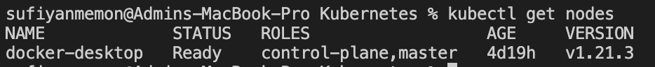

# Nodes
## Get nodes infromation
get a list of all installed nodes. Using Docker Desktop, there should be only one.
```
kubectl get nodes
```


get some info about the node
```
kubectl describe node [nodeName] // if you have 1 node then you can skip the name para 
```
