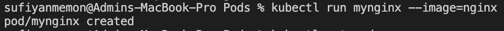
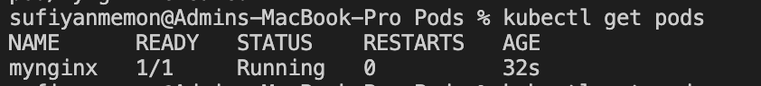
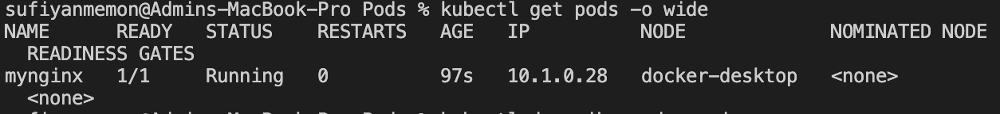
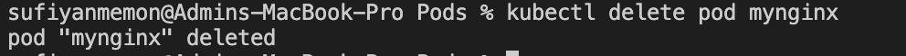
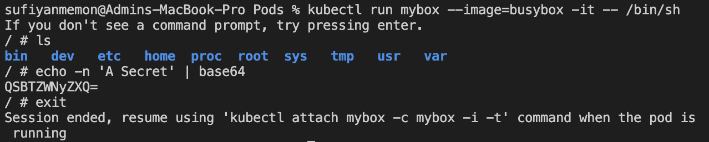
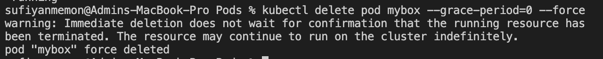
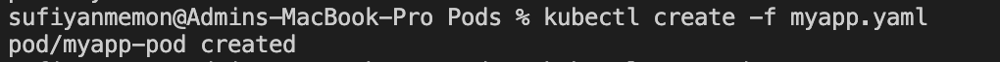
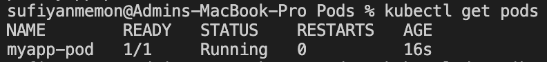
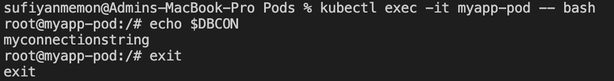
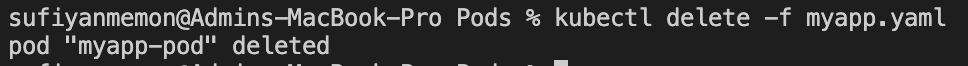

# Pods
Lets first create a node running Nginx by using hte imperative way
## Create the pod
```
kubectl run mynginx --image=nginx
```

## Get a list of running pods
```
kubectl get pods
```

## Get more info
```
kubectl get pods -o wide
kubectl describe pod mynginx
```

## Delete the pod
```
kubectl delete pod mynginx
```

## Create a pod running BusyBox
Lets now create a node running BusyBox, this time attaching bash to our terminal
```
kubectl run mybox --image=busybox -it -- /bin/sh
```
## List the folders and use command
```
ls
echo -n 'A Secret' | base64
exit
```

## Cleanup
```
kubectl delete pod mybox --wait-false
```
or
```
kubectl delete pod mybox --grace-period=0 --force
```

## Create a pod using the declarative way
let's now create a node using a YAML file
```
kubectl create -f myapp.yaml
```

## Get some info
```
kubectl get pods -o wide
kubectl describe pod myapp-pod
```

## Attach our terminal
```
kubectl exec -it myapp-pod -- bash
```
print the DBCON environment variable that was set in the YAML file
```
echo $DBCON
```

## Detach from the instance 
```
exit
```
## Cleanup
```
kubectl delete -f myapp.yaml
```

