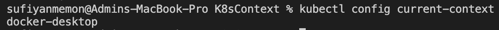

# K8s context
## get current context
```
kubectl config current-context
```
- Example 

## List all contexts
```
kubectl config get-contexts
```
- Example


## Change context
```
kubectl config use-context [contextName]
```

## Rename context
```
kubectl config rename-context [old-name] [new-name]
```

## Delete context
```
kubectl config delete context [contextName]
```