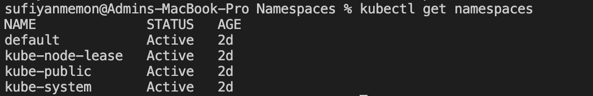
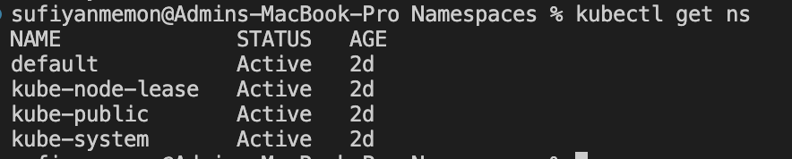
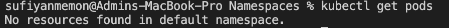
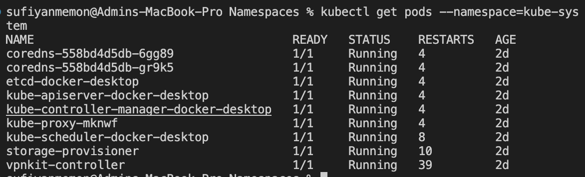
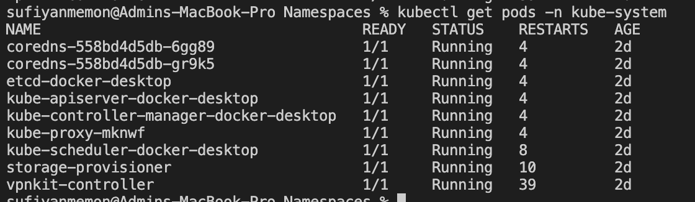
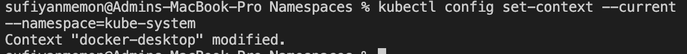
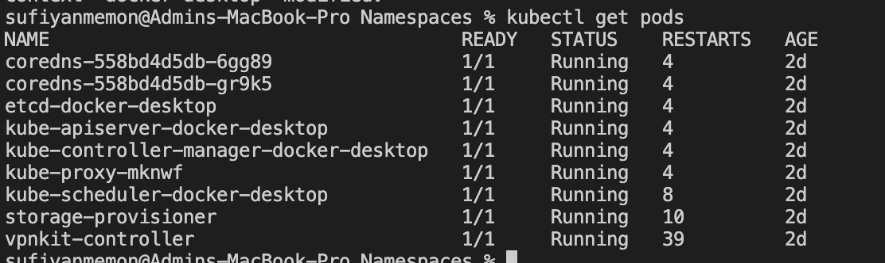
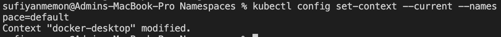
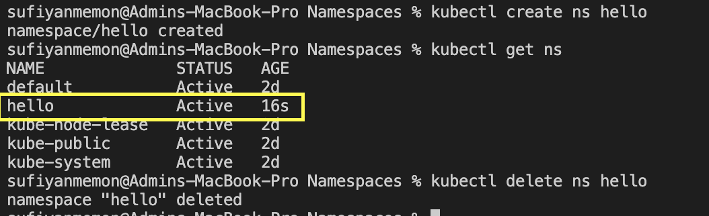

# Namespaces
## Get namespaces
```
kubectl get namespaces
kubectl get ns // shortcut
```
- Example 
- 1

- 2 shortcut way

## Get the pods list
```
kubectl get pods
```
- Example

- You get the pods from the default namespace. Try getting the pods from the docker namespace. You will get a diffrent list.
```
kubectl get pods --namespace=kube-system
// or
kubectlget pods -n kube-system
```
- Example
- 1

- 2

## Change namespace
```
kubectl config set-context --current --namespace=kube-system
```

- see if you gets pods on this namespace
```
kubectl get pods
```

- lets chnage back to default
```
kubectl config set-context --current --namespace=default
```

## Create and delete a namespace
```
kubectl create ns [name]  // create
kubectl get ns  // gets lists
kubectl delete ns [name]  // delete // alert while deleteing it 
```
